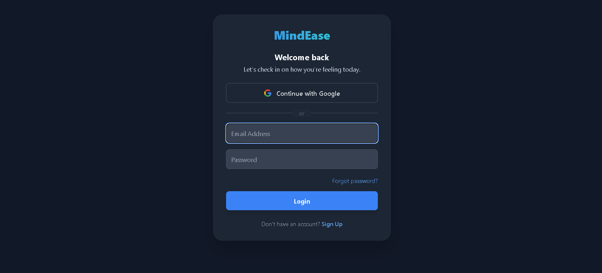
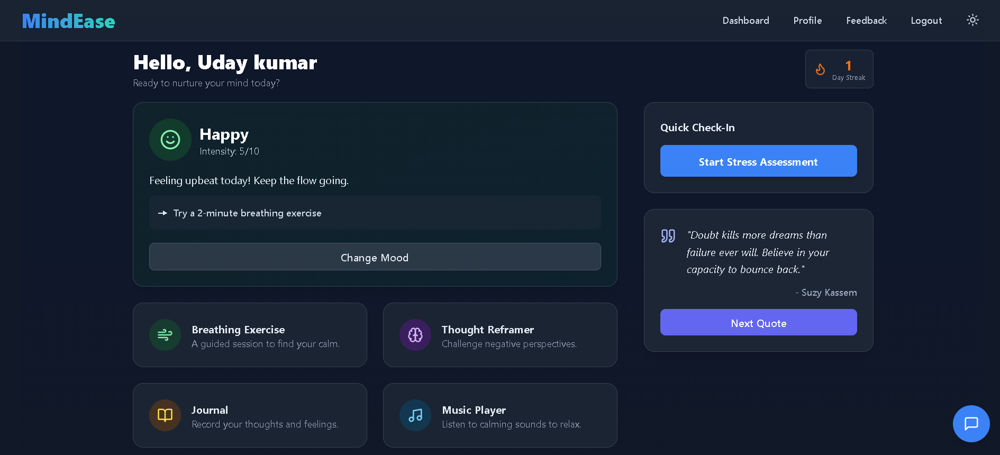
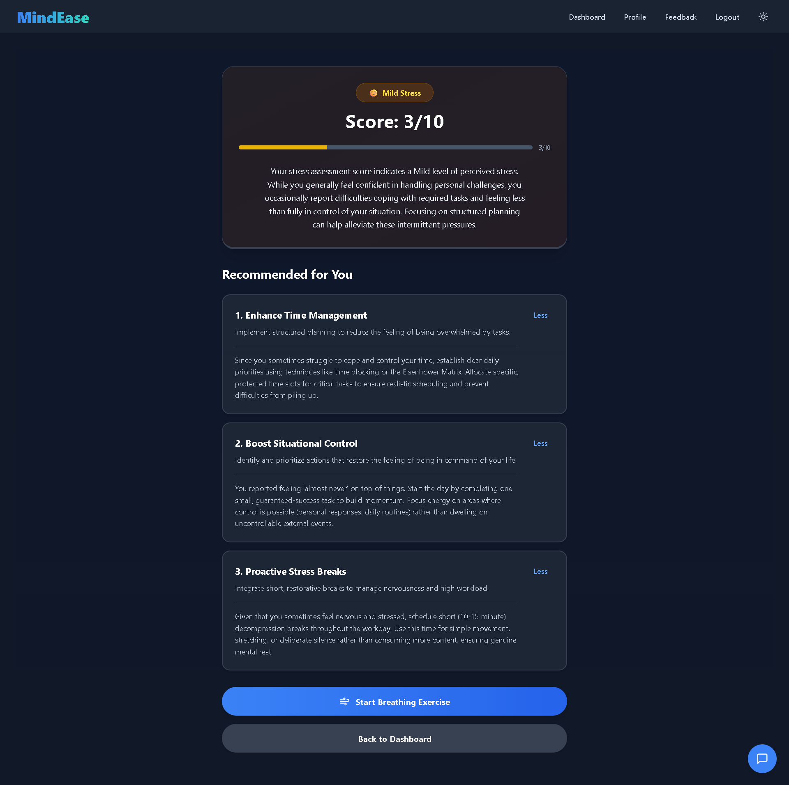
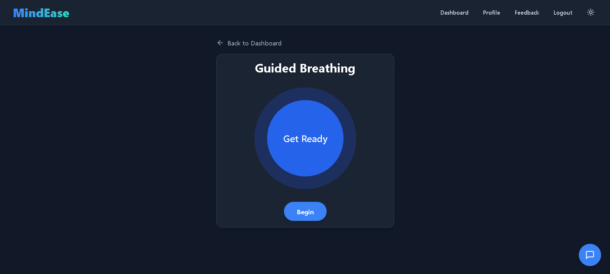
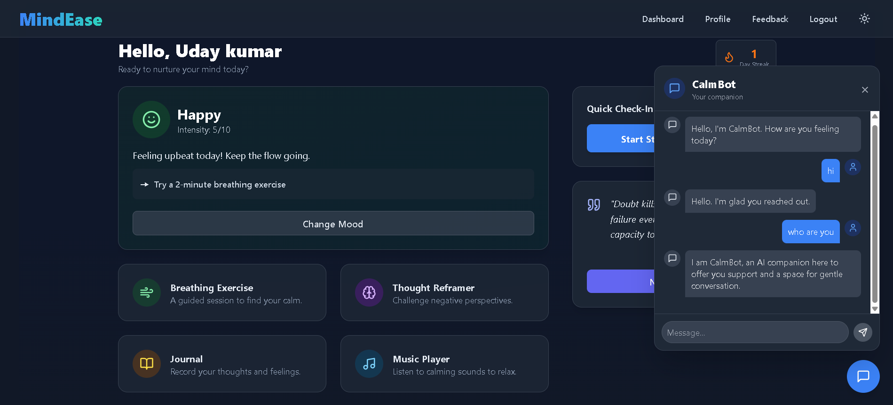
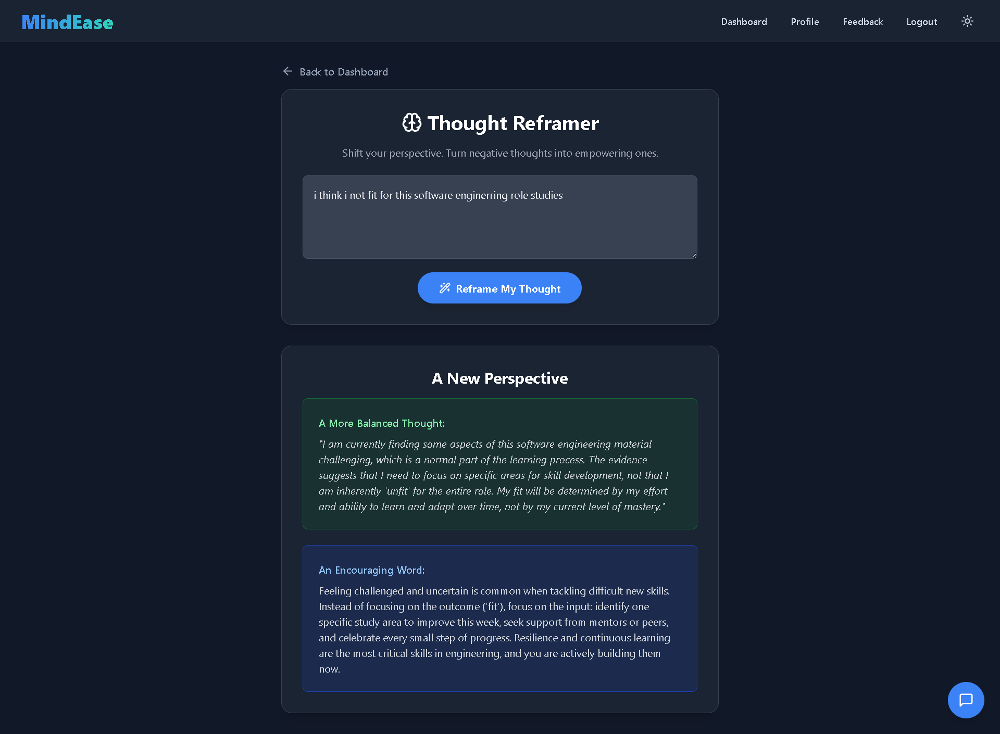
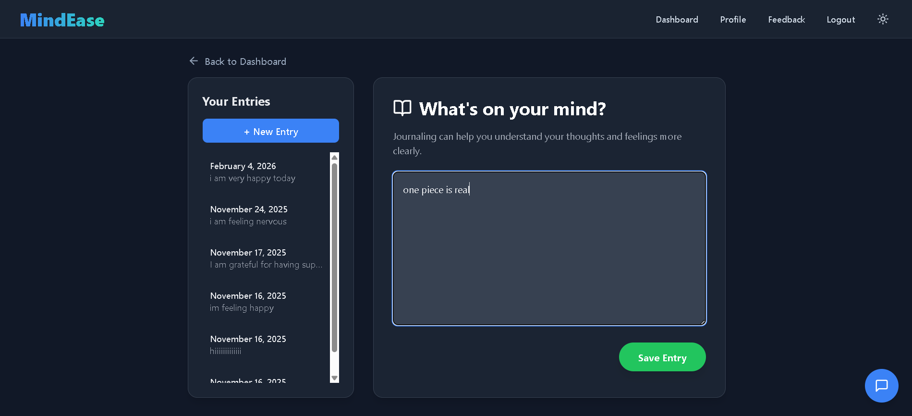
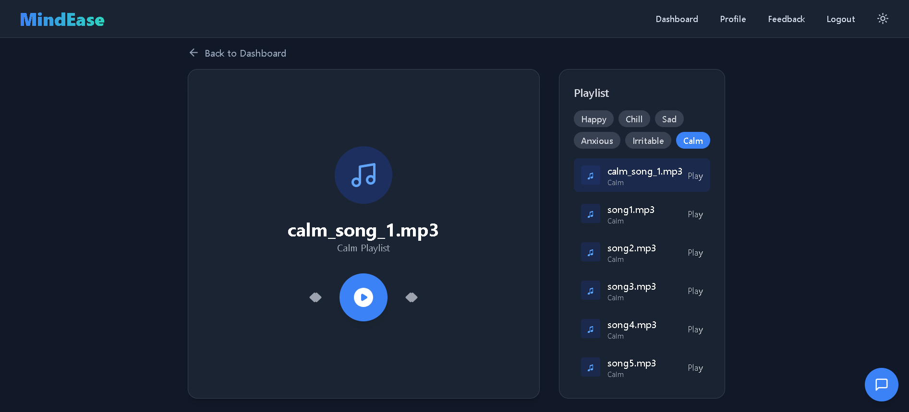
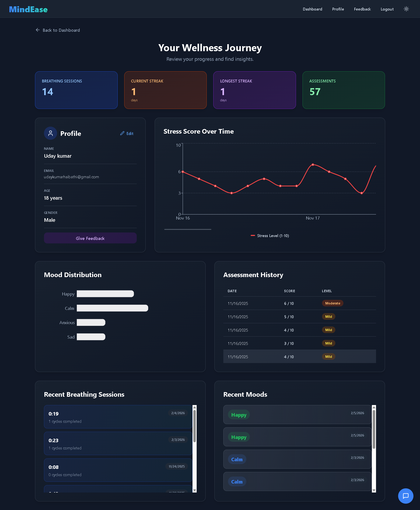
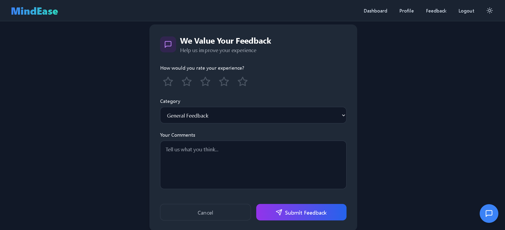

# Mental Health Toolkit

A comprehensive full-stack application for mental health assessment, stress tracking, breathing exercises, and wellness management. Designed to help users understand and manage their stress levels with personalized recommendations.

## 🌐 Live Demo

**Try MindEase now:** [https://mindease-mental-health-toolkit.web.app/](https://mindease-mental-health-toolkit.web.app/)

---

## 🎯 Project Overview

The Mental Health Toolkit is a two-part application:

- **Frontend**: React + TypeScript application with a modern, responsive UI
- **Backend**: Node.js/Express API with Firebase Firestore database

### Key Features

- 🧠 **Stress Assessment**: 12-question PSS-based assessment to evaluate stress levels
- 🌬️ **Guided Breathing Exercises**: Interactive breathing sessions with cycle tracking
- 🤖 **CalmBot AI**: AI-powered chatbot for mental wellness support (Gemini API)
- 💭 **Thought Reframer**: Tool to restructure negative thought patterns
- 📝 **Journaling**: Personal journal entries for self-reflection
- 🎵 **Mood Tracker & Music**: Track mood and access calming music
- 📊 **Progress Tracking**: View assessment history and trends
- 👤 **User Profiles**: Personalized dashboards with stats and recommendations
- 🔐 **Secure Authentication**: Firebase Auth with Google Sign-in and Email/Password
- 💾 **Cloud Database**: Firebase Firestore for data persistence

---

## 📸 Screenshots

### Sign In Page


### Dashboard


### Stress Assessment Results


### Breathing Exercise


### CalmBot AI Chatbot


### Thought Reframer


### Journal Entry


### Mood Tracker & Music Player


### Profile Page


### Feedback Page


---

## 📁 Project Structure

```
mental_health_toolkit/
├── server/                    # Backend (Node.js/Express)
│   ├── index.js              # Server entry point
│   ├── database.js           # Firebase Firestore connection
│   ├── auth.js               # Authentication middleware
│   ├── routes/               # API endpoints (14 route files)
│   │   ├── auth.js          # Auth routes (signup, login)
│   │   ├── assessment.js    # Assessment submission & history
│   │   ├── breathing.js     # Breathing session routes
│   │   ├── profile.js       # User profile routes
│   │   ├── questions.js     # Assessment questions
│   │   ├── journals.js      # Journal entries
│   │   ├── mood-logs.js     # Mood tracking
│   │   ├── streaks.js       # User streaks
│   │   ├── music.js         # Music player routes
│   │   ├── export.js        # Data export
│   │   ├── feedback.js      # User feedback
│   │   ├── ai.js            # CalmBot AI (Gemini API)
│   │   ├── quotes.js        # Motivational quotes
│   │   └── report.js        # Report generation
│   ├── data/                # Static data files
│   │   ├── questions.json   # 12 PSS assessment questions
│   │   ├── quotes.json      # Motivational quotes
│   │   └── musicks/         # Music files (36 tracks)
│   └── package.json
│
└── mindease/                  # Frontend (React/TypeScript)
    ├── App.tsx               # Main app component with routing
    ├── index.tsx             # Entry point
    ├── index.html            # HTML template
    ├── firebase.ts           # Firebase configuration
    ├── components/           # React components (16 files)
    │   ├── AuthPage.tsx     # Login/Signup with Firebase Auth
    │   ├── Dashboard.tsx    # Main dashboard
    │   ├── Profile.tsx      # User profile
    │   ├── StressAssessment.tsx # 12-question assessment
    │   ├── AssessmentResults.tsx # Results display
    │   ├── BreathingExercise.tsx # Guided breathing
    │   ├── CalmBot.tsx      # AI chatbot
    │   ├── FloatingChatBot.tsx # Chat widget
    │   ├── ThoughtReframer.tsx # Thought reframing
    │   ├── Journal.tsx      # Journal entries
    │   ├── MoodTracker.tsx  # Mood tracking
    │   ├── MoodCard.tsx     # Mood display card
    │   ├── MusicPlayer.tsx  # Music player
    │   ├── FeedbackForm.tsx # User feedback
    │   ├── Header.tsx       # Navigation header
    │   └── Signup.tsx       # Signup form
    ├── services/             # API service layer
    ├── utils/                # Utility functions
    ├── types.ts              # TypeScript types
    ├── constants.ts          # App constants
    ├── vite.config.ts        # Vite configuration
    └── package.json
```

---

## 🚀 Getting Started

### Prerequisites

- **Node.js** v16 or higher
- **npm** v7 or higher
- **Firebase Project** with Firestore enabled

### 1️⃣ Backend Setup

#### Step 1: Navigate to server directory

```bash
cd server
```

#### Step 2: Install dependencies

```bash
npm install
```

#### Step 3: Create environment file

Create a `.env` file with your Firebase and Gemini API credentials:

```bash
PORT=5000
GEMINI_API_KEY=your_gemini_api_key
```

#### Step 4: Start the server

```bash
npm run dev
# or
npm start
```

**Expected output:**
```
🚀 Server running on port 5000
🔥 Connected to Firebase Firestore
```

#### API Endpoints Available:

**Authentication:**
- `POST /api/auth/signup` - Register new user
- `POST /api/auth/login` - Login user
- `GET /api/auth/user` - Get current user

**Assessment:**
- `POST /api/assessment/submit` - Submit assessment
- `GET /api/assessment/history` - Get assessment history
- `GET /api/assessment/latest` - Get latest assessment
- `GET /api/questions` - Fetch 12 PSS questions

**Wellness Features:**
- `POST /api/breathing/sessions` - Save breathing session
- `GET /api/breathing/sessions` - Get breathing sessions
- `POST /api/journals` - Create journal entry
- `GET /api/journals` - Get journal entries
- `POST /api/mood-logs` - Log mood
- `GET /api/mood-logs` - Get mood history
- `GET /api/streaks` - Get user streaks

**AI & Content:**
- `POST /api/ai/chat` - CalmBot AI conversation
- `GET /api/quotes` - Get motivational quotes
- `GET /api/music` - Get music tracks

**User:**
- `GET /api/profile` - Get user profile
- `POST /api/feedback` - Submit feedback
- `GET /api/export` - Export user data

---

### 2️⃣ Frontend Setup

#### Step 1: Open new terminal, navigate to frontend

```bash
cd mindease
```

#### Step 2: Install dependencies

```bash
npm install
```

#### Step 3: Configure Firebase

Update `firebase.ts` with your Firebase project credentials.

#### Step 4: Start development server

```bash
npm run dev
```

**Expected output:**
```
VITE v5.4.19  ready in 234 ms

➜  Local:   http://localhost:5173/
➜  press h to show help
```

#### Step 5: Open in browser

Visit `http://localhost:5173` in your web browser

---

## 📖 How the Stress Assessment Works

### Assessment Flow

1. **User takes 12-question PSS assessment**
   - Questions based on Perceived Stress Scale (PSS)
   - Each question has 5 options: "Never" (0) → "Very Often" (4)

2. **Score Calculation**
   - Each answer is scored 0-4 points
   - Total raw score = sum of all 12 answers
   - Maximum possible score = 12 × 4 = 48 points

3. **Percentage Conversion**
   - Stress percentage = (Raw Score ÷ 48) × 100
   - Example: Raw Score of 24 = (24 ÷ 48) × 100 = **50%**

4. **Stress Level Classification**
   - **Low**: 0-30%
   - **Moderate**: 31-60%
   - **High**: 61-80%
   - **Severe**: 81-100%

5. **Recommendations**
   - Based on stress level, user receives targeted recommendations
   - Low stress → "Maintain current wellness habits"
   - Moderate → "Try breathing exercises, take breaks"
   - High → "Consider professional support"
   - Severe → "Seek professional help immediately"

---

## 🔐 Authentication System

The app uses **Firebase Authentication** with multiple sign-in options:

1. **Email/Password Authentication**
   - Secure signup with email verification
   - Password requirements enforced

2. **Google Sign-In**
   - One-click authentication
   - Profile synced from Google account

3. **Session Management**
   - Firebase ID tokens for API authentication
   - Automatic token refresh
   - Secure logout

---

## 🌬️ Breathing Exercise Feature

Users can perform guided breathing exercises:

- **Duration**: Customizable (default 2 minutes)
- **Cycles**: Inhale → Hold → Exhale (4-4-4 seconds)
- **Tracking**: Session saved with:
  - Duration in seconds
  - Number of cycles completed
  - Timestamp

---

## 🤖 CalmBot AI

CalmBot is an AI-powered mental wellness chatbot:

- **Powered by**: Google Gemini API
- **Features**:
  - Empathetic conversations
  - Mental wellness tips
  - Stress management techniques
  - Available 24/7

---

## 🛠️ Tech Stack

### Frontend
- **React** 18 - UI framework
- **TypeScript** - Type safety
- **Vite** - Build tool
- **Tailwind CSS** - Styling
- **Firebase Auth** - Authentication
- **Lucide React** - Icon library

### Backend
- **Node.js** with **Express** - Server framework
- **Firebase Firestore** - Cloud database
- **Google Gemini API** - AI chatbot
- **CORS** - Cross-origin requests

---

## 📧 Support & Contact

For issues, questions, or suggestions:
- Open an issue on GitHub
- Email: udaykumarhaibathi@gmail.com

---

## 📄 License

MIT License - Feel free to use this project for personal or commercial purposes.

---

## 🤝 Contributing

Contributions are welcome! Please:
1. Fork the repository
2. Create a feature branch
3. Make your changes
4. Submit a pull request

---

**Happy coding! 💙**
